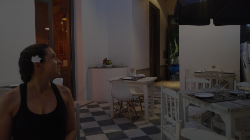
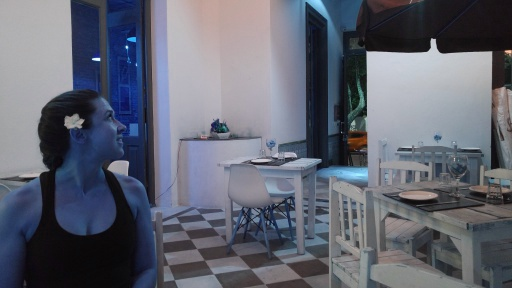

# tech.opencv

[](https://clojars.org/techascent/tech.opencv)

OpenCV bindings via javacpp.

You can read a bit more about it [here](http://techascent.com/blog/opencv-love.html).

## Usage


### Basic

Load/save, resize, clone.  Becase opencv matrixes need to be released and thus aren't garbage collected they are bound to a think.resource.core/resource-context which unwinds in a way similar to C++ RAII or with-open.

Bindings to clojure.core.matrix and tech.datatype allow you to get into the properties of
a loaded matrix.

```clojure
(require '[tech.opencv :as opencv])
(require '[tech.v2.datatype :as dtype])
(require '[tech.v2.datatype.functional :as dfn])

      (let [src-img (opencv/load "test/data/test.jpg")
          dest-img (opencv/clone src-img)
          num-elems (dtype/ecount src-img)
          ;;Save as jpg and spend an hour scratching head...
          test-fname "darken.png"
          convert-fn (fn [input]
                       (float (Math/floor (* 0.5 input))))]
      ;;darken img.  Float data is range 0-255
      (delete-test-file! test-fname)
      (-> (unary-op/unary-reader :int16 (unchecked-short (quot x 2)) src-img)
          (dtype/copy! dest-img)
          (opencv/save test-fname))
      (let [result (opencv/load test-fname)
            result-data (float-array num-elems)]
        (dtype/copy! result result-data)
        (is (dfn/equals (take 10 result-data)
                        (map convert-fn (take 10 (dtype/->reader src-img)))))))
```




### Datatype Tensors

Integrated with the tech.v2.tensor math system:

```clojure
(require '[tech.v2.tensor :as dtt])
    (let [test-image (opencv/load "test/data/test.jpg")
          ;;Select is in-place so this did not change the image at all.
          bgr-image (dtt/select test-image :all :all [2 1 0])
		  ;;Copy src dest
          dest-image (dtype/copy! bgr-image (dtype/from-prototype test-image))]
      ;;The datatype library has the convention that the thing that is mutated
	  ;;is returned from the function.
      (opencv/save dest-image "bgr.jpg"))
```




A bit more involved example:


```clojure
   (let [test-image (opencv/load "test/data/test.jpg")
         result
         (-> test-image
             (dtt/select :all :all [2 1 0])
             (dfn/+ 50)
             ;;Clamp top end to 0-255
             (dfn/min 255)
             (dtype/copy! (dtype/from-prototype test-image)))]

      (opencv/save result "bgr-lighten.jpg"))
```


### Further Reference


Please refer to the [tests](test/tech/opencv_test.clj),
[tensor tests](test/tech/opencv_compute_test.clj),
and [opencv.clj](src/tech/opencv.clj).


## License

Copyright © 2019 [Tech Ascent, LLC](https://github.com/tech-ascent).

Distributed under the Eclipse Public License either version 1.0 or (at
your option) any later version.
