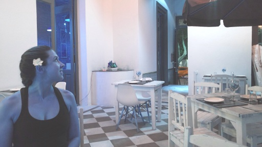

# tech.opencv

[](https://clojars.org/techascent/tech.opencv)

OpenCV bindings via javacpp.

## Usage


### Basic

Load/save, resize, clone.  Becase opencv matrixes need to be released and thus aren't garbage collected they are bound to a think.resource.core/resource-context which unwinds in a way similar to C++ RAII or with-open.

Bindings to clojure.core.matrix and tech.datatype allow you to get into the properties of
a loaded matrix.

```clojure
      (let [src-img (opencv/load "test/data/test.jpg")
            dest-img (opencv/clone src-img)
            num-elems (m/ecount src-img)
            float-data (float-array num-elems)
            mult-data (float-array num-elems)
            ;;Save as jpg and spend an hour scratching head...
            test-fname "darken.png"
            convert-fn (fn [input]
                         (float (Math/round (* 0.5 input))))]
        (dtype/copy! src-img float-data)
        ;;darken img.  Float data is range 0-255
        (c-for [idx (int 0) (< idx num-elems) (inc idx)]
               (aset mult-data idx (float
                                    (convert-fn (aget float-data idx)))))
        (delete-test-file! test-fname)
        (-> (dtype/copy! mult-data dest-img)
            (opencv/save test-fname))
        (let [result (opencv/load test-fname)
              result-data (float-array num-elems)]
          (dtype/copy! result result-data)
          (is (m/equals (take 10 result-data)
                        (map convert-fn (take 10 float-data))))))
```


### Compute Tensors

Integrated with the compute.tensor math library:

```clojure
    (let [test-image (opencv/load "test/data/test.jpg")
          image-tens (cpu-tm/typed-bufferable->tensor test-image)
          ;;Select is in-place so this did not change the image at all.
          bgr-image (ct/select image-tens :all :all [2 1 0])
          dest-tens (-> (ct/new-tensor (ct/shape bgr-image)
                                       :datatype (ct/get-datatype image-tens))
                        (ct/assign! bgr-image))]
      ;;The tensor library has the convention that the thing that is mutated
      ;;is the first thing.  Also the thing that is mutated is returned from
      ;;the function.
      (ct/assign! image-tens dest-tens)
      (opencv/save test-image "bgr.jpg"))
```


A bit more involved example:


```clojure
    (let [test-image (opencv/load "test/data/test.jpg")
          image-tens (cpu-tm/typed-bufferable->tensor test-image)
          bgr-img (ct/select image-tens :all :all [2 1 0])]
      (ct/assign! image-tens (-> (ct/new-tensor (ct/shape bgr-img) :datatype :uint16)
                                 (ct/assign! bgr-img)
                                 (op/+ 50)
                                 ;;Clamp top end to 0-255
                                 (op/min 255)))

      (opencv/save test-image "bgr-lighten.jpg"))
```




### Further Reference


Please refer to the [tests](test/tech/opencv_test.clj),
[compute tests](test/tech/opencv_compute_test.clj),
and [opencv.clj](src/tech/opencv.clj).


## License

Copyright © 2018 [Tech Ascent, LLC](https://github.com/tech-ascent).

Distributed under the Eclipse Public License either version 1.0 or (at
your option) any later version.
